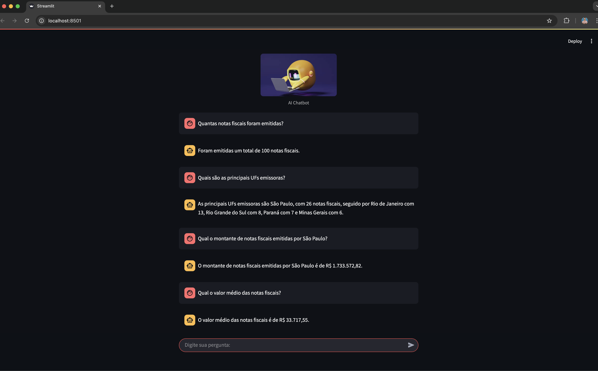

# AI Agent para Análise de Dados de Notas Fiscais

Sistema de IA para análise de dados de notas fiscais com arquitetura modular.

## 🏗️ Stack tecnológica, módulos e estrutura da solução

### 🛠️ Tecnologias Utilizadas

- **Python 3.8+**
- **Flask** - API REST
- **Streamlit** - Interface web
- **LangChain** - Processamento de IA
- **OpenAI GPT** - Modelo de linguagem
- **SQLite** - Banco de dados
- **Pandas** - Manipulação de dados
- **PyYAML** - Configurações

### 📁 Estrutura e módulos da solução

```
ai-agent-csv-python/
├── appAgent.py          # API Flask principal
├── chat.py              # Interface Streamlit para usuários
├── config.py            # Gerenciamento de configurações via YAML
├── config.yaml          # Arquivo de configuração
├── database.py          # Gerenciamento do banco de dados SQLite
├── ai_processor.py      # Processamento de IA com LangChain e OPENAI
├── memory_manager.py    # Gerenciamento de memória de conversas
├── file_processor.py    # Processamento de arquivos CSV/ZIP
├── requirements.txt     # Dependências
├── database/            # Pasta do banco SQLite
├── files/               # Arquivos de dados
│   ├── 202401_NFs.zip
│   └── csv-files/
└── images/              # Imagens da interface
```


## 🚀 Como Usar

### 1. Instalação

Crie um ambiente virtual

```bash
python -m venv <nome-do-seu-ambiente>
```

Ative seu ambiente virtual (no mac)

```bash
source <nome-do-seu-ambiente>/bin/activate 
```

ou no Windows no cmd
```bash
nome_do_ambiente\Scripts\activate.bat
```

Instale as bibliotecas

```bash
pip install -r requirements.txt
```

### 2. Configuração

Crie um arquivo de environment `.env` com sua chave da OPENAI na raiz do projeto

```bash
OPENAI_API_KEY=SUA_CHAVE_AQUI
```

Edite o arquivo `config.yaml` para configurar:

- Modelo de IA (gpt-3.5-turbo, gpt-4, etc.)
- Caminhos do banco de dados
- Caminhos dos arquivos

### 3. Execução

Execute diretamente o arquivo principal:

```bash
python appAgent.py
```

O sistema irá:

- Descompactar automaticamente os arquivos ZIP necessários
- Criar e configurar o banco de dados
- Iniciar o servidor Flask na porta 5001

### 4. Interface Web

```bash
streamlit run chat.py
```

## 📡 API Endpoints

### POST `/ask`

Processa perguntas sobre os dados de notas fiscais.

**Request:**

```json
{
  "question": "Quantas notas fiscais existem?",
  "client_id": "user123"
}
```

**Response:**

```json
{
  "answer": "Encontrei um total de 1.234 notas fiscais no período analisado.",
  "sql_query": "SELECT COUNT(*) as total FROM receipts",
  "client_id": "user123"
}
```

## 🗄️ Estrutura do Banco de Dados

### Tabela `receipts` (Cabeçalho das NFs)

- CHAVE_DE_ACESSO
- VALOR_NOTA_FISCAL
- DATA_EMISSAO
- UF_EMITENTE
- CNPJ_EMITENTE
- NOME_EMITENTE
- ... (outras colunas)

### Tabela `items` (Itens das NFs)

- CHAVE_DE_ACESSO
- DESCRICAO_PRODUTO
- QUANTIDADE
- VALOR_UNITARIO
- VALOR_TOTAL
- ... (outras colunas)

## 🔧 Melhorias Implementadas

### 1. **Modularização**

- Separação clara de responsabilidades
- Código mais organizado e testável
- Reutilização de componentes

### 2. **Configuração Centralizada**

- Arquivo YAML para configurações
- Fácil alteração de parâmetros
- Configurações por ambiente

### 3. **Gerenciamento de Banco**

- Classe dedicada para operações de banco
- Índices para melhor performance
- Tratamento de erros robusto

### 4. **Processamento de IA Melhorado**

- Prompts mais específicos e detalhados
- Melhor formatação de respostas
- Tratamento de diferentes tipos de resultados

### 5. **Logging e Monitoramento**

- Logs detalhados para debugging
- Tratamento de erros aprimorado

### 6. **Gerenciamento de Memória**

- Memória por cliente
- Limpeza seletiva de memórias
- Suporte a múltiplos usuários


## 🎯 Exemplos de Perguntas




## 🔍 Funcionalidades

- ✅ Análise de dados de notas fiscais
- ✅ Geração automática de queries SQL
- ✅ Respostas em linguagem natural
- ✅ Interface web amigável
- ✅ API REST simplificada
- ✅ Gerenciamento de memória
- ✅ Logging detalhado
- ✅ Configuração flexível
- ✅ Arquitetura modular


## 📝 Licença

Este projeto é parte do curso I2A2 desenvolvido por **Reinaldo B. Camargo**
